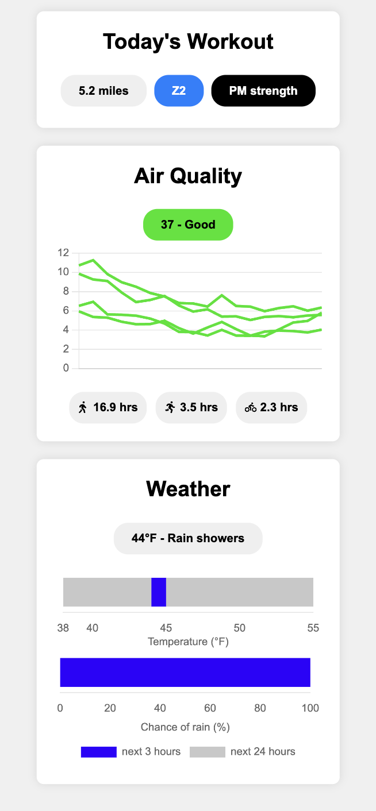
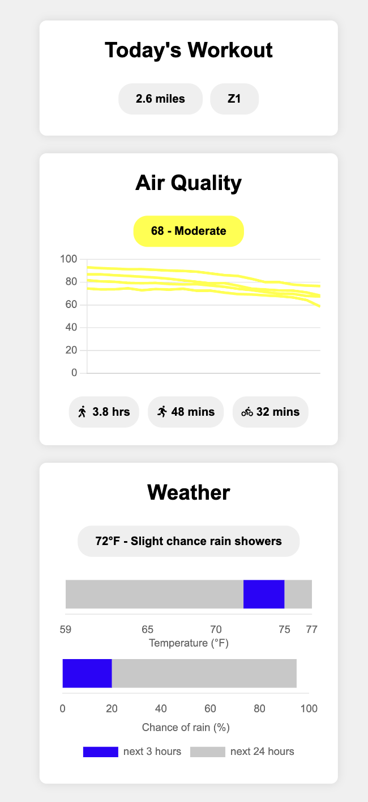

# Endurance Training App

**Author**: Hunter R. Merrill

<p float="left" align="middle">
  
   
</p>

## Description
This repo contains code for a web app that assists with endurance training. A user will typically view this app daily to obtain information and recommendations to assist with planning the day's exercises. Currently, the app is optimized to view in a browser on a mobile device, and is set up to be hosted from a raspberry pi on a local network.

The home page displays three widgets:
1. Recommended workout: displays the recommended workout for today.
2. Weather: displays the forecasted weather for the day.
3. AQI: displays the current and forecasted air quality index.

On the homepage, the widgets display a short summary of information, and clicking buttons within each widget will show the user information about the data displayed in the widget. Code for the frontend is in the `frontend` subdirectory.

The backend Python server retrieves AQI information from the PurpleAir API and AirNow API, and recommended workout information is retrieved from from a local file. Code for the backend is in the `backend` subdirectory.

## For developers

### Prerequisites
You will need Python. You will also need API keys for [AirNow](https://docs.airnowapi.org/) and [PurpleAir](https://api.purpleair.com/) stored in the environment variables `AIRNOW_API_KEY` and `PURPLEAIR_API_KEY` (though the workout and weather widgets will work without these keys). For hosting the app on a Raspberry Pi, you just need a Pi that has been set up for SSH access (and if you have AirNow and PurpleAir API keys, put them on that machine, too).

### Local
Clone the repo and install poetry, the required dependencies, and the backend package:
```bash
# clone repo and navigate to root directory
git clone git@github.com:hrmerrill/endurance-training-app.git
cd endurance-training-app

# install poetry and create a fresh virtual environment
python -m pip install poetry
python -m venv .venv

# install dependencies and backend package
poetry update
poetry install
```

Start the backend server:
```bash
poetry run python backend/server.py
```

Your local machine is now running the server. In a browser, you can navigate to `http://localhost:8081/` to view the raw outputs of the server, and you can open `frontend/index.html` to view the website.

### Raspberry Pi
SSH into your Raspberry Pi. Update libraries and install Apache:
```bash
sudo apt update
sudo apt upgrade
sudo apt install apache2 -y
```

From a browser on a machine on the same network as the Pi, navigate to `raspberrypi.local` to ensure that Apache is hosting the default website.

Now clone this repo to the Pi and install the dependencies. Poetry may not work-- if it does not, use `pip` to manually install the dependencies listed in `pyproject.toml` under `tool.poetry.dependencies`. Start the server in the background:
```bash
python backend/server.py > /dev/null 2>&1 &
```

Copy the frontend contents to `/var/www/html`, the directory from which Apache hosts the website:
```bash
cp frontend/* /var/www/html/
```

Again navigate to `raspberrypi.local` to see that Apache is now hosting the endurance training webapp.

## Files
* `backend` contains Python scripts that run the backend of the app.
  - `server.py` contains a server to serve up the data to the frontend.
  - `endurance_training_app` contains a python package with the modules required to run the server. The package and dependencies are managed by Poetry through the `pyproject.toml` file (which auto-generates the `poetry.lock` file).
* `frontend` contains Javascript and CSS to create the web app.
  - `styles.css` contains style definitions for objects in the web app.
  - `index.html` contains the static contents and layout of the page.
  - `app.js` contains the dynamic contents, loading data from the backend server.